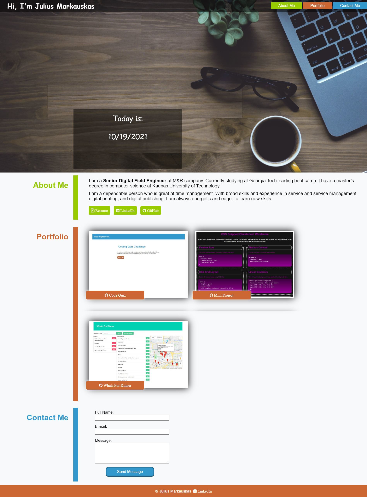

# Julius Markauskas Portfolio

## Description

A portfolio of work: 

 - About Me, Resume, LinkedIn, and GitHub.

 - Latest projects. 

 - Contact information.

## Link to website
https://juliusm9791.github.io/Portfolio/

## Mock-Up
The following picture shows web application:

## Technologies used
Java Script

HTML

CSS

API

#### CSS reset file

https://necolas.github.io/normalize.css/

#### Social icons

https://cdnjs.cloudflare.com/ajax/libs/font-awesome/4.7.0/css/font-awesome.min.css

#### Free pictures

https://pixabay.com/

## Questions

  To reach me with additional questions

  GitHub: [Juliusm9791](https://github.com/Juliusm9791)

  Email: juliusm9791@gmail.com