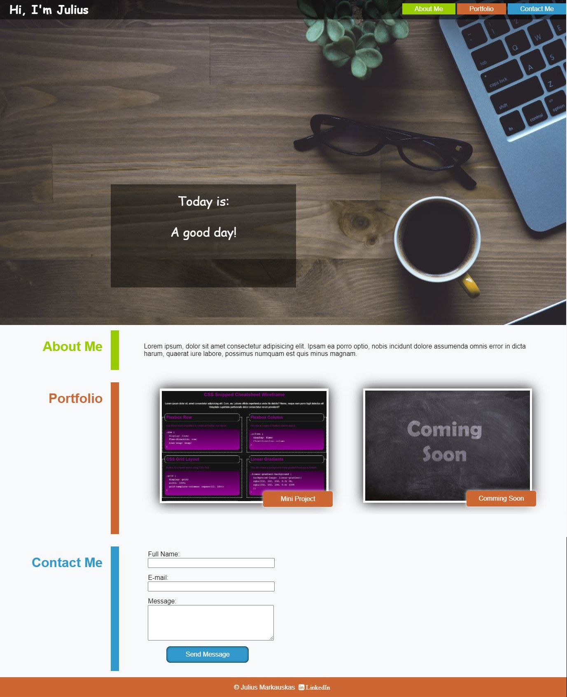

# 02-Advanced-CSS-Portfolio Homework

On click one of the links in the navigation, it scrolls to the corresponding section.

With the mouse over application, that application's image become larger in size than the others.

Click on the images of the applications and it takes to that deployed application.

When resize the page or view the site on various screens and devices it changes layout that adapts to screen size.

## Link to website
https://juliusm9791.github.io/Portfolio/

## Mock-Up
The following picture shows web application:

### CSS reset file

https://necolas.github.io/normalize.css/

### Social icons

https://cdnjs.cloudflare.com/ajax/libs/font-awesome/4.7.0/css/font-awesome.min.css

### Free pictures

https://pixabay.com/